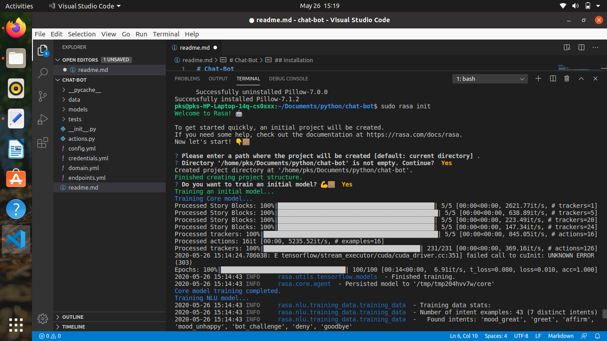

# Chat-Bot
## installation

- sudo pip install rasa
- sudo rasa init


## Importent concepts:
### Intent:
Intent means purpose/aim/target of chatbot of the user input
example, if user typed "I want to order a book?" here intent would be "ordering..."
### Entity:
useful information that can be extracted from user like, "I want to order a book?" from this  we extract "book" as an entity.
### Action :
It is just a response from the chatbot so it can be a code reply or api response

### Stories:
These are a sample interaction between the user and bot, defined in terms of intents captured and actions performed.

### Domain:
Domain knowledge is  required to reply for any user query.

### We can define this all concepts in code as follows:

- Intent and Entity ==> nlu.md
- Story (Dialogue Management) ==> Stories.md
- Actual output (Hard code)[all intent , action, response] ==> domain.yml
- Custom reply ==> action.py

## Architecture


The steps are:

1. The message is received and passed to an Interpreter, which converts it into a dictionary including the original text, the intent, and any entities that were found.
2. The Tracker is the object which keeps track of conversation state. It receives the info that a new message has come in.
3. The policy receives the current state of the tracker.
4. The policy chooses which action to take next.
5. The chosen action is logged by the tracker.
6. A response is sent to the user.

# Covid19 Chat-Bot:

For covid19 chat bot we are using external opensource api https://api.covid19india.org/data.json 
following are the steps to build basic chatbot
### Steps:
1. Edit nlu.md file and write intent
```

## intent:corona_status
- [india](state)
- [corona](state)
- [karnataka](state)
- [mumbai](state)
- [bihar](state)
- [delhi](state)
- [panjab](state)
- [asam](state)
- [andhra pradesh](state)
```
2. Edit stories.md file
```
## corona status path 
* corona_status
  - action_corona_status

```
3. Edit domain.yml and add action 
```
actions:
  - action_corona_status
  - action_hello_world
  - action_search_restaurant
```
4. Edit action.py 
```
class ActionCoronaTracker(Action):

    def name(self) -> Text:
        return "action_corona_status"

    def run(self, dispatcher: CollectingDispatcher,
            tracker: Tracker,
            domain: Dict[Text, Any]) -> List[Dict[Text, Any]]:
        
        response = requests.get('https://api.covid19india.org/data.json').json()

        entities = tracker.latest_message['entities']
        state=None
        message = "Active cases are {0}\n, confirmed cases are {1}\n, Total deaths are {2}\n, Total patient recovered are {3}\n"
        for e in entities:
            if e['entity'] == 'state':
                state=e['value']
            for data in response["statewise"]:
                if data['state']==state.title():
                    
                    message = message.format(data['active'], data['confirmed'],data['deaths'],data['recovered'])

                else:
                    message = "Sorry data not available for input: {}".format(state)
            
        dispatcher.utter_message(text=message)

        return []
```


### To run server 
```sh
    sudo rasa run actions
```
### To run shell
```sh
    sudo rasa shell
```
### Lets see how it works!!!
```
Your input ->  hi                                                                                                                             
Hey! How are you?
Your input ->  good                                                                                                                           
Great, carry on!
Your input ->  maharashtra

Active cases are 35186
, confirmed cases are 52667
, Total deaths are 1695
, Total patient recovered are 15786

```

